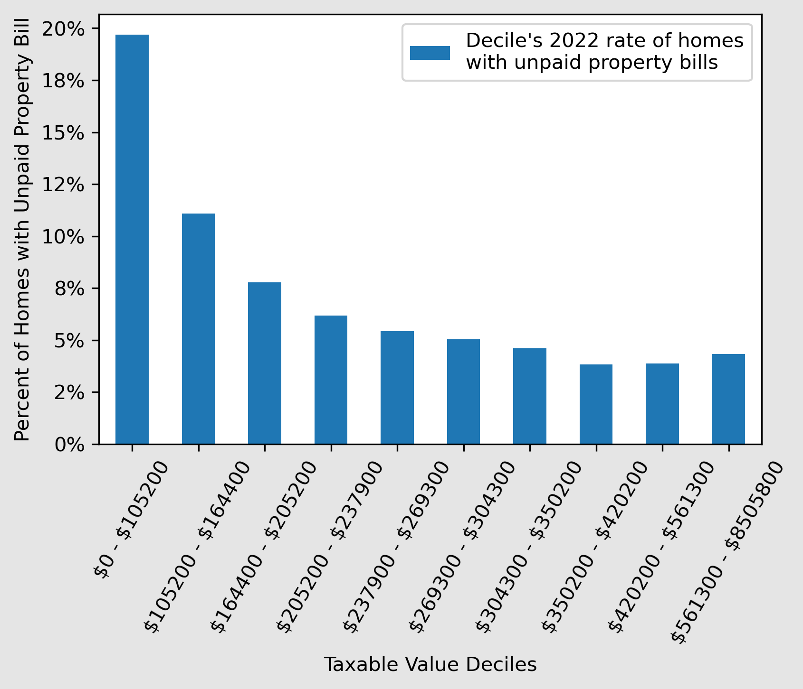

## Overview

This analysis aims to explore the potential relationship between unpaid property bills and gentrification in Buncombe County, with a focus on single-family homes. Specifically, it examines unpaid property bills from two perspectives:

- The rates of unpaid property bills among home-valuation quintiles and deciles.
- The correlation between unpaid property bills and rising home valuations in different housing-valuation quintiles.
## Unpaid Property Bills and Rising Home Valuations

- The rates of unpaid property bills were higher among groups of lower housing valuations.
- In the highest housing-valuation decile, rates of unpaid property bills were roughly three times higher than in the lowest housing-valuation decile.
## Rates of Unpaid Property Bills

Urban3 has already shown that homes in the bottom quintiles have experienced a sharper rise in valuations, likely contributing to gentrification. 

My analysis builds on this, by showing that the bottom quintiles are also shouldering more of the unpaid property bills, with higher rates of unpaid property bills across lower housing-valuation quintiles and deciles.

It should be noted that this analysis was conducted independently from Urban3's research and therefore the methodology is likely different. Any comparisons or extrapolations should be made with caution.
## Percent Change in Property Value by Unpaid Bills

The question this next section aims to answer is whether a higher percent change in property value increases the probability of an unpaid bill.

Further research is needed to fully understand the relationship between unpaid property bills and gentrification in Buncombe County. However, unpaid bills could be an early-stage symptom of gentrification, as it becomes more expensive to pay taxes on homes.

This is the beginning of a model that tries to predict unpaid bills. Perhaps learning more about what potentially causes unpaid bills could help us make public policy recommendations to curb gentrification.

The variable `total_value_pct_change` represents the percent change in taxable real estate value for single-family homes from 2020 to 2021, and `unpaid_bill` is a binary variable indicating whether or not a property owner has an unpaid bill.

I used a logistic regression model since unpaid_bill is binary and total_value_pct_change is continuous.

The results of the logistic regression indicate that there is a negative association between the percent change in taxable real estate value for single-family homes and the likelihood of a property owner having an unpaid bill. Specifically, for every 1% increase in the percent change in taxable real estate value, the odds of a property owner having an unpaid bill decrease by 1.89%. Additionally, this relationship holds true across housing-value quintiles.

The results of this model are preliminary. There could be a wide range of explanations for this relationship. A colleague of mine suggested that perhaps "if the valuation goes up because the property has been renovated/sold then part of the mortgage process is probably to make sure the taxes are all current."