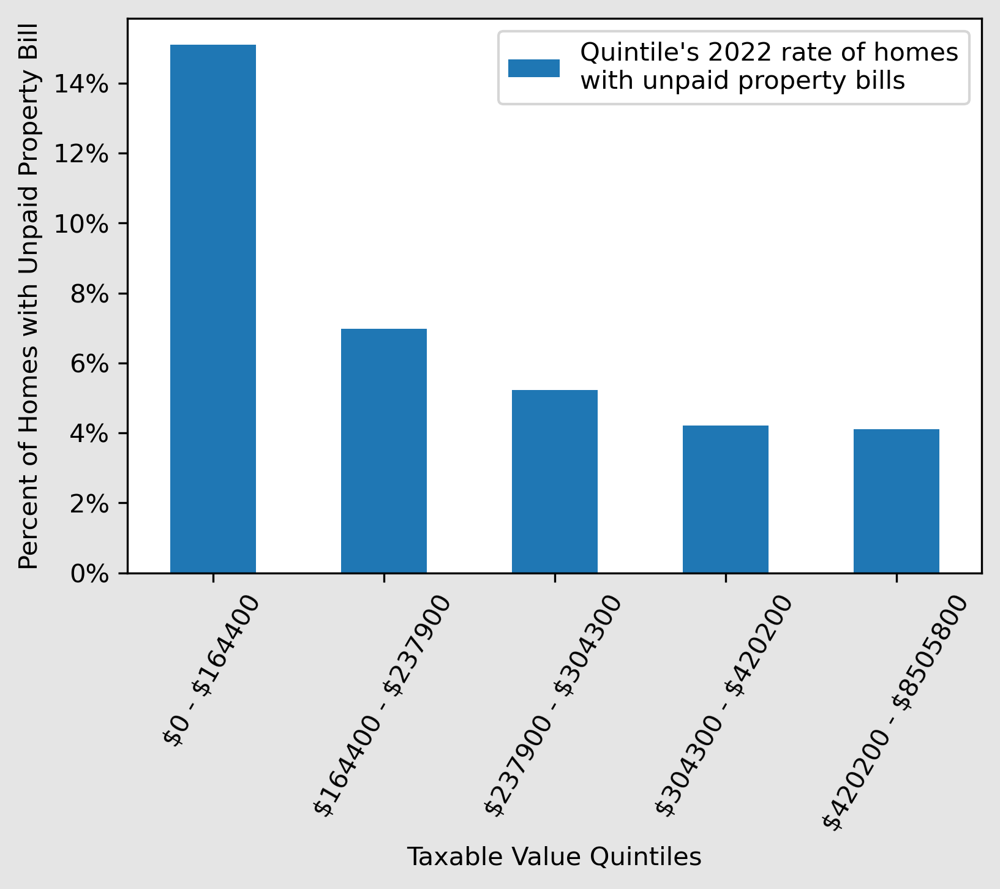

## Overview

This analysis aims to explore the potential relationship between unpaid property bills and gentrification in Buncombe County, with a focus on single-family homes. Specifically, it examines unpaid property bills from two perspectives:

- The rates of unpaid property bills among home-valuation quintiles and deciles.
- A logistics regression that looks for correlation between unpaid property bills and rising home valuations, among other factors, in different housing-valuation quintiles.

In addition to the README, the [Jupyter Notebook](unpaid_property_bills_analysis.ipynb) in this repositry contains comments on my methodology. I pulled this data on January 25, 2022.

## Highlighted Preliminary Findings

- The rates of unpaid property bills in 2022 were higher among groups with lower housing valuations.
- In the lowest housing-valuation decile, rates of unpaid property bills in 2022 were more than four times higher than in the decile with the highest valuations.
## Rates of Unpaid Property Bills

Urban3 has already shown that homes in the bottom quintiles have experienced a sharper rise in valuations, likely contributing to gentrification. 

My analysis builds on this, by showing that the bottom quintiles are also shouldering more of the unpaid property bills, with higher rates of unpaid property bills across lower housing-valuation quintiles and deciles.




It should be noted that this analysis was conducted independently from Urban3's research and therefore the methodology may be different. Any comparisons or extrapolations should be made with caution.

A note about the unpaid property bills data: I called the County's GIS help line and a gentleman there told me that unpaid bills with a "PIN" value would be real-estate related, while those without it would be a different type of property. This is key to how I joined the unpaid bill data to the parcels data. You will see in the notebook that merging on both address and city did not increase the number of unpaid bills associated with parcels, leading me to believe that this is correct.
## What factors lead to unpaid property bills?

Does a higher percent change in property value increase the probability of an unpaid bill? 

Further research is needed to fully understand the relationship between unpaid property bills and gentrification in Buncombe County.

However, unpaid bills could be an early-stage symptom of gentrification, as it becomes more expensive to pay taxes on homes.

I ran a logistic regression aimed at identifying the factors that influence the likelihood of a property owner having an unpaid bill. The dependent variable, `unpaid_bill`, is a binary variable indicating whether or not a property owner had an unpaid bill in 2022.

The independent variables include `total_value_pct_change`, `median_hh_income`, `income_gini`, `pct_white`, `pct_bachelor`, and `pct_rented`.  

The `total_value_pct_change` variable represents the percent change in taxable real estate value for a single-family home in Buncombe County from 2020 to 2021.

The remaining variables I pulled or calculated from the 2021 American Community Survey at the Census Tract level. The `median_hh_income` variable represents the median household income. The `income_gini` variable represents the Gini coefficient of income inequality. The `pct_white` variable represents the percent of the population that is white in a given tract. The `pct_bachelor` variable represents the percent of the population with a bachelor's degree in a given tract. The `pct_rented` variable represents the percent of the housing units that are rented in a given tract.

The results of the logistic regression suggest that there are several independent variables that are associated with the likelihood of a property owner having an unpaid bill, however these results are only preliminary and more research is needed to fully understand these relationships. 

With that said, the results suggest that a higher percent change in taxable value, higher median household income and a higher percentage of rented households are associated with lower odds of having an unpaid bill.  

Meanwhile, a larger white population in a census tract is associated with higher odds of having an unpaid bill. 

A tract’s Gini coefficient and the percentage of people with a bachelor's degree do not appear to have a statistically significant effect on the dependent variable.

```
Logit Regression Results                           
==============================================================================
Dep. Variable:            unpaid_bill   No. Observations:                81924
Model:                          Logit   Df Residuals:                    81917
Method:                           MLE   Df Model:                            6
Date:                Mon, 30 Jan 2023   Pseudo R-squ.:                0.005162
Time:                        13:52:01   Log-Likelihood:                -20840.
converged:                       True   LL-Null:                       -20948.
Covariance Type:            nonrobust   LLR p-value:                 6.533e-44
==========================================================================================
                             coef    std err          z      P>|z|      [0.025      0.975]
------------------------------------------------------------------------------------------
const                     -1.7856      0.258     -6.927      0.000      -2.291      -1.280
total_value_pct_change    -0.0009      0.000     -3.328      0.001      -0.001      -0.000
median_hh_income        -1.63e-05   1.33e-06    -12.250      0.000   -1.89e-05   -1.37e-05
income_gini               -0.2117      0.271     -0.781      0.435      -0.743       0.320
pct_white                  0.0042      0.002      1.964      0.049    9.51e-06       0.008
pct_bachelor               0.0155      0.021      0.725      0.469      -0.026       0.057
pct_rented                -0.0066      0.001     -4.848      0.000      -0.009      -0.004
==========================================================================================  
```
